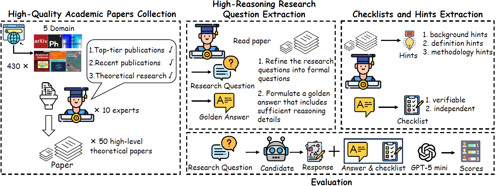
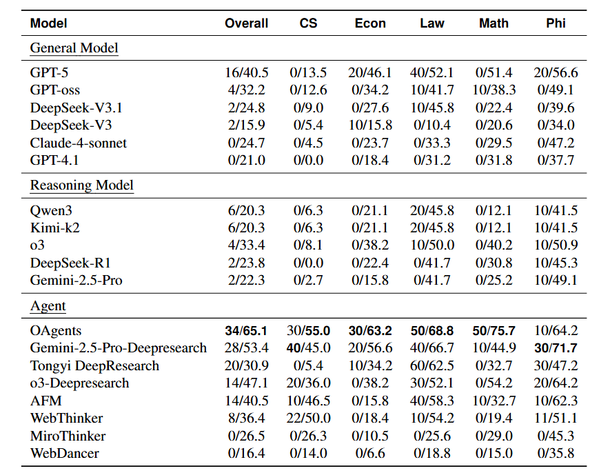

# ACADREASON Benchmark 🧠📚

[**🤗 Hugging Face**](https://huggingface.co/datasets/PersonalAILab/Acadreason_benchmark) | [**📖 Acadreason arXiv**](http://arxiv.org/abs/2510.11652)

This repo contains the evaluation code and dataset for the paper [**ACADREASON: Exploring the Limits of Reasoning Models with Academic Research Problems**](http://arxiv.org/abs/2510.11652).

## 🔔 News

- **🔥[2025-10-14] Introducing ACADREASON, a challenging benchmark for evaluating LLMs and agents on high-level academic reasoning tasks! 🚀**

## 🧩 Introduction

ACADREASON is a benchmark designed to evaluate the ability of large language models (LLMs) and agents to acquire and reason over academic knowledge. It consists of **50 expert-annotated academic research questions** across five high-reasoning domains: **computer science, economics, law, mathematics, and philosophy.** All questions are sourced from top-tier publications between 2023 and 2025, focus on theoretical content, and undergo rigorous annotation and quality control to ensure they are both challenging and answerable.

Unlike existing benchmarks that focus on simpler tasks like arithmetic or commonsense reasoning, ACADREASON emphasizes challenging, high-level academic reasoning. It simulates real-world research scenarios, requiring models to possess cutting-edge academic knowledge and demonstrate deep reasoning capabilities without access to the original papers. Our evaluation of 10 mainstream LLMs and agents shows that most LLMs scored below 20 points, with even GPT-5 achieving only 16 points. Agents performed better but none exceeded 40 points, highlighting a significant capability gap. We believe ACADREASON will drive advancements in reasoning models and agents toward super‑intelligent academic research capabilities. 🚀



## 🏗️ Dataset Creation

ACADREASON was built through a meticulous process: collecting 430 high-quality papers from top-tier journals, filtering to 50 theoretical works, extracting research questions with golden answers, and adding checklists and hints. The dataset is in JSONL format for easy use in evaluation.

- **✅ Multi-disciplinary coverage**: Computer Science, Economics, Law, Mathematics, Philosophy.
- **✅ High-quality annotations**: Each question includes a detailed golden answer and checklist for scoring.
- **💡 Multi-level hints**: Background, definition, and methodology hints to analyze knowledge impact.
- **🧾 Structured format**: Standardized fields like `task_id`, `domain`, `query`, `golden_truth`, `checklist`, `hints_background`, `hints_methodology`.

For more details, refer to the dataset file:

- `data/acadreason_benchmark.jsonl` -  dataset (50 questions).


## 🧪 Experiment

Use the scripts below to run **infer** and **judge** on the ACADREASON benchmark.

### ⚙️ Setup

Install dependencies:

```bash
pip install -r requirements.txt
```

🔐 Create a `.env` file for API configuration:

```bash
OPENAI_API_KEY=YOUR_OPENAI_KEY 
OPENAI_API_BASE=https://api.openai.com/v1
```
The main experiment results are as follow:


### 🚀 Quick start (infer & judge)

- **infer**: Generate model responses (supports multiple models in parallel).

```bash
python infer.py --experiment infer_50_hints0 
```

- **judge**: Use LLM-as-judge (GPT-5-mini) to score responses against golden answer and checklists.

```bash
python judge.py --experiment judge_infer_50_hints0
```

### 🧰 Experiment configuration

Configurations are managed in `config.yaml`:

- 🔧 Model settings: API keys, parameters, reasoning modes.
- 🧪 Experiment details: Data paths, prompt templates, evaluation strategies.
- 📦 Output: Results saved in `results/`, with error logs.

📊 The benchmark uses two metrics:

- **Pass Rate ($R_p$)**: Exact match with golden answer (0 or 1 per question).
- **Checklist Score ($R_j$)**: Proportion of satisfied checklist items.

🎯 **Dataset usage**

- The full 50-question dataset is available for development, validation, and testing.
- Use hints for ablation studies to evaluate knowledge impact.
- Outputs: **infer** in `results/infer/{experiment}/{model}.jsonl`, **judge** in `results/judge/{experiment}/`.

## LICENCE
This project uses the Apache License 2.0, see the [LICENSE] file for details.

## 📝 Citation

**🔖 BibTeX:**

```bibtex
@article{acadreason2025,
  title={ACADREASON: Exploring the Limits of Reasoning Models with Academic Research Problems},
  author={Xin Gui and King Zhu and JinCheng Ren and Qianben Chen and Zekun Moore Wang and Yizhi LI and Xinpeng Liu and Xiaowan Li and Wenli Ren and Linyu Miao and Tianrui Qin and Ziqi Shu and He Zhu and Xiangru Tang and Dingfeng Shi and Jiaheng Liu and Yuchen Eleanor Jiang and Minghao Liu and Ge Zhang and Wangchunshu Zhou},
  journal={arXiv preprint arXiv:2510.11652},
  year={2025}
}
```